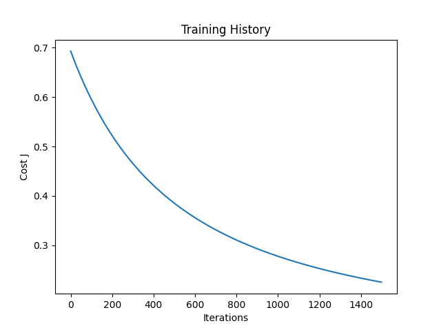

# Tweet Sentiment Analysis System


A Logistic Regression-based sentiment analysis engine built from scratch using NumPy. This project demonstrates the implementation of custom gradient descent, feature extraction, and tweet preprocessing without relying on high-level ML frameworks like Scikit-learn or TensorFlow.

## 📂 Project Structure

```bash
.
├── assets/             # Cost figure
├── tests/              # Unit tests for system validation
├── config.py           # Configuration parameters
├── data_loader.py      # NLTK data handling
├── features.py         # Feature extraction logic
├── main.py             # Entry point (CLI)
├── model.py            # Logistic Regression Model Class
├── preprocess.py       # Text cleaning & tokenization
├── utils.py            # Math helpers (Sigmoid, Cost)
├── requirements.txt    # Dependencies
└── README.md           # Documentation
```

## 🧠 Methodology

The project implements a complete NLP pipeline from scratch:

1. **Preprocessing**: Tokenization, Stemming (PorterStemmer), Stopwords removal, and Regex cleaning.
2. **Feature Extraction**: Maps each tweet to a frequency dictionary `(word, label) -> count`.
3. **Model**: Logistic Regression with Sigmoid activation.
   * Prediction: ŷ = σ(θᵀx)
   * Cost Function: Binary Cross-Entropy.
   * Optimization: Gradient Descent.

## 🚀 Installation

### 1. Clone the repository

```bash
git clone https://github.com/yourusername/sentiment-analysis.git
cd sentiment-analysis
```

### 2. Install dependencies

```bash
pip install -r requirements.txt
```

## 🛠 Usage

### Training the Model

To train the model on the NLTK Twitter dataset and visualize the training loss:

```bash
python main.py --mode train --plot
```

The model weights will be saved to `saved_model.pkl`.

### Prediction (Inference)

To predict the sentiment of a specific text:

```bash
python main.py --mode predict --text "I am so happy learning AI today!"
```

**Output:**

```
Tweet: I am so happy learning AI today!
Sentiment: POSITIVE
```

## 🧪 Running Tests

To ensure the system works as expected and validate the mathematical functions:

```bash
python -m unittest discover tests
```
## 📊 Results & Visualization

After training for 1500 iterations, the model achieves:

* **Accuracy**: ~99.0% (on Test set)
* **Training Time**: < 5 seconds

### Training History

The cost function decreases steadily, indicating proper convergence:

<p align="center">

</p>

## ✨ Key Features

* **No "Black Box"**: Every math formula (Sigmoid, Gradient Descent) is implemented manually in Python/NumPy.
* **Custom Preprocessing**: Handles Twitter-specific artifacts like hashtags, handles (`@user`), and URLs.
* **Production Ready**: Includes `logging`, `argparse` for CLI, and modular code structure.


## 🤝 Contributing

Contributions are welcome! Please feel free to submit a Pull Request.

## 📧 Contact

Contact me via email: `longnguyendinh2411@gmail.com`